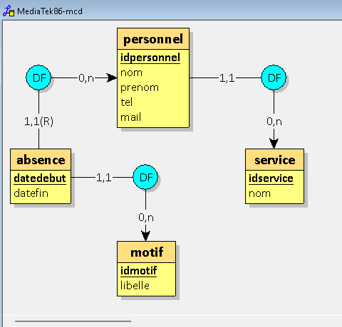
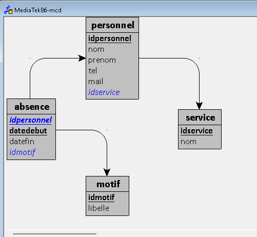
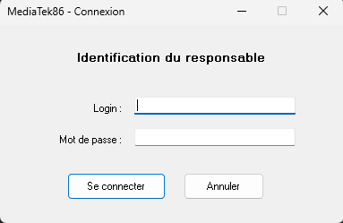
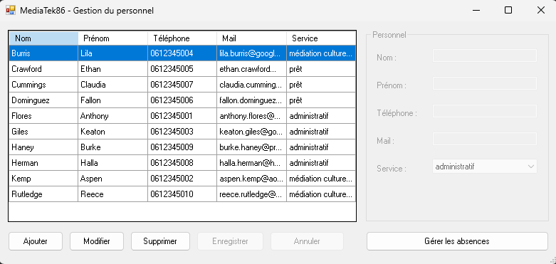
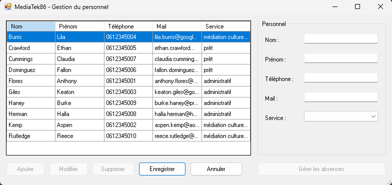
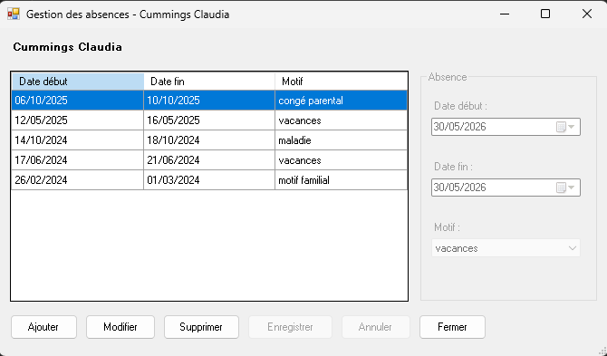
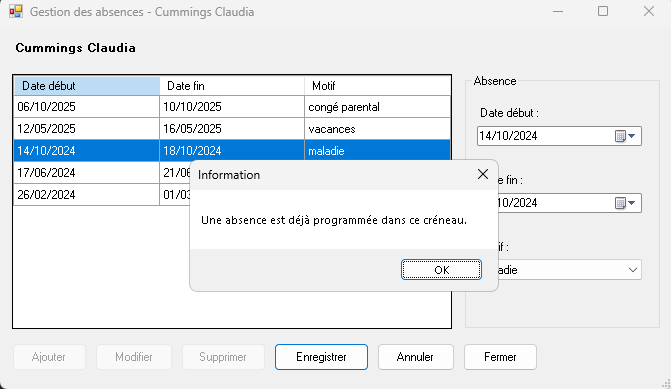
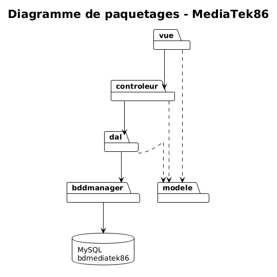

# MediaTek86

Application Windows Forms de gestion du personnel et des absences des médiathèques publiques de la Vienne (86), développée en C# .NET Framework pour le compte de l'association MediaTek86.

## Contexte

L'association MediaTek86 gère 4 médiathèques sur le département de la Vienne. Le service des ressources humaines souhaite informatiser la gestion du personnel de ces établissements ainsi que le suivi de leurs absences. L'application est utilisée par un responsable identifié par login et mot de passe.

## But de l'application

L'application permet à un responsable RH authentifié de :
- Consulter, ajouter, modifier et supprimer les membres du personnel
- Consulter, ajouter, modifier et supprimer les absences de chaque membre du personnel
- Empêcher la saisie d'absences qui se chevauchent

## Modèle Conceptuel de Données (MCD)

Le MCD est composé de 4 entités principales :
- **personnel** : un membre du personnel d'une médiathèque (nom, prénom, téléphone, mail)
- **service** : le service auquel est rattaché un personnel (administratif, médiation culturelle, prêt)
- **absence** : une période d'absence d'un personnel, identifiée par sa date de début
- **motif** : le motif d'une absence (vacances, maladie, motif familial, congé parental)

Une table supplémentaire **responsable** (login, pwd haché en SHA-256) permet l'authentification.

## Modèle Logique de Données (MLD)

## Interfaces

### Formulaire de connexion

### Formulaire de gestion du personnel

### Formulaire de gestion du personnel - mode ajout

### Formulaire de gestion des absences

### Détection de chevauchement

## Diagramme de paquetages

L'application suit une architecture en couches MVC + DAO + Singleton :
- **vue** : formulaires Windows Forms (FrmConnexion, FrmGestion, FrmAbsences)
- **controleur** : contrôleurs MVC qui font le lien entre vue et DAL
- **dal** : couche d'accès aux données (un XxxAccess par entité)
- **bddmanager** : singleton de connexion à MySQL (BddManager)
- **modele** : classes métier (Personnel, Service, Motif, Absence)

#### Explications sur les couches supplémentaires

L'application contient 2 paquetages supplémentaires par rapport au MVC classique :
- **bddmanager** : contient la classe qui permet d'accéder à la base de données MySQL et d'exécuter les requêtes (classe indépendante et réutilisable).
- **dal** (Data Access Layer) : répond aux demandes du paquetage `controleur` et exploite `bddmanager` en lui demandant d'exécuter des requêtes.

L'avantage de cette architecture est l'isolement de la connexion (`bddmanager`) par rapport au reste de l'application. Le contrôleur ne sait pas d'où viennent les données. Le paquetage `dal` fait l'intermédiaire en préparant des requêtes SQL paramétrées. Changer de SGBDR reviendrait à juste modifier la classe `BddManager`.

## Étapes de construction

Le projet a été développé en 6 étapes successives, avec un commit par étape ou sous-étape :

### Étape 1 - Base de données
Création de la base `bdmediatek86` avec Looping (génération du MCD puis du MLD), import du script SQL initial et insertion des données (3 services, 4 motifs, 1 responsable, 10 personnels, 50 absences).

### Étape 2 - Structure MVC, dépôt GitHub et visuel des formulaires
- Initialisation du projet WinForms .NET Framework 4.7.2
- Création de la structure de dossiers MVC (vue, controleur, modele, dal, bddmanager)
- Initialisation du dépôt GitHub et du kanban de suivi
- Codage du visuel des 3 formulaires (FrmConnexion, FrmGestion, FrmAbsences)

Commits :
- `Initial commit : structure MVC du projet (etape 2 atelier CNED)`
- `Etape 2 : ajout du visuel des formulaires (FrmConnexion, FrmGestion, FrmAbsences) et suppression de Form1`

### Étape 3 - Modèle, accès aux données et documentation technique
- Création du singleton `BddManager` (connexion MySQL, requêtes paramétrées)
- Création de la classe `Access` (DAL) qui lit la chaîne de connexion dans App.config
- Création des 4 classes métier (Personnel, Service, Motif, Absence)
- Génération de la documentation technique avec SandCastle Help File Builder

Commit : `Etape 3 : ajout BddManager, Access (DAL), classes metier (Personnel, Service, Motif, Absence), chaine de connexion et documentation technique (zip)`

### Étape 4 - Cas d'utilisation fonctionnels
Implémentation des 8 cas d'utilisation en plusieurs commits :
- `Etape 4 UC1 : authentification du responsable (ResponsableAccess, FrmConnexionController, correction chaine connexion MySQL 8)`
- `Etape 4 : couche d'acces aux donnees (ServiceAccess, MotifAccess, PersonnelAccess, AbsenceAccess) et controleurs (FrmGestionController, FrmAbsencesController)`
- `Etape 4 UC2-3-4 : gestion CRUD des personnels (ajout, modification, suppression avec confirmation) dans FrmGestion`
- `Etape 4 UC5-6-7-8 : gestion des absences (affichage antichronologique, ajout/modification/suppression avec detection de chevauchement) - Etape 4 complete`

### Étape 5 - Vidéo de démonstration
Enregistrement d'une vidéo de démonstration de 5 minutes présentant toutes les fonctionnalités de l'application.

### Étape 6 - Déploiement et livrables
- Génération du script SQL complet de déploiement (CREATE + INSERT + utilisateur applicatif)
- Création de l'installeur .msi
- Rédaction du présent README
- Création de la page portfolio

Commit : `Etape 6 : script SQL complet de deploiement (mediatek86-complet.sql)`

## Installation

### Prérequis
- Windows 10 ou 11
- .NET Framework 4.7.2 ou supérieur
- MySQL 8.x avec XAMPP/WAMP

### 1. Importer la base de données
1. Démarrer WampServer
2. Ouvrir phpMyAdmin via http://localhost/phpmyadmin
3. Se connecter en tant que `root`
4. Onglet "Importer", sélectionner le fichier `bdd/mediatek86-complet.sql`
5. Cliquer sur "Exécuter"

Le script crée la base `bdmediatek86`, les tables, les données initiales et l'utilisateur applicatif `adminmediatek` (mot de passe : `mediatek86`).

### 2. Installer l'application
Exécuter le fichier `MediaTek86Setup.msi` situé dans le dossier `installeur/` et suivre les étapes de l'assistant.

### 3. Lancer l'application
Démarrer "MediaTek86" depuis le menu Démarrer.

### 4. Se connecter
- Login : `admin`
- Mot de passe : `admin`

## Auteur

Projet réalisé dans le cadre du BTS SIO option SLAM (CNED) - 2026
